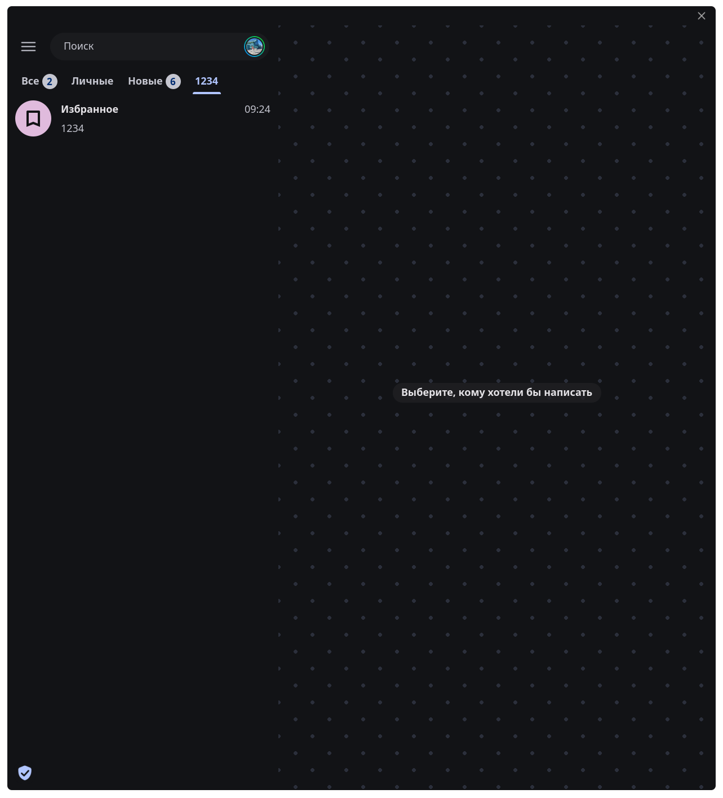
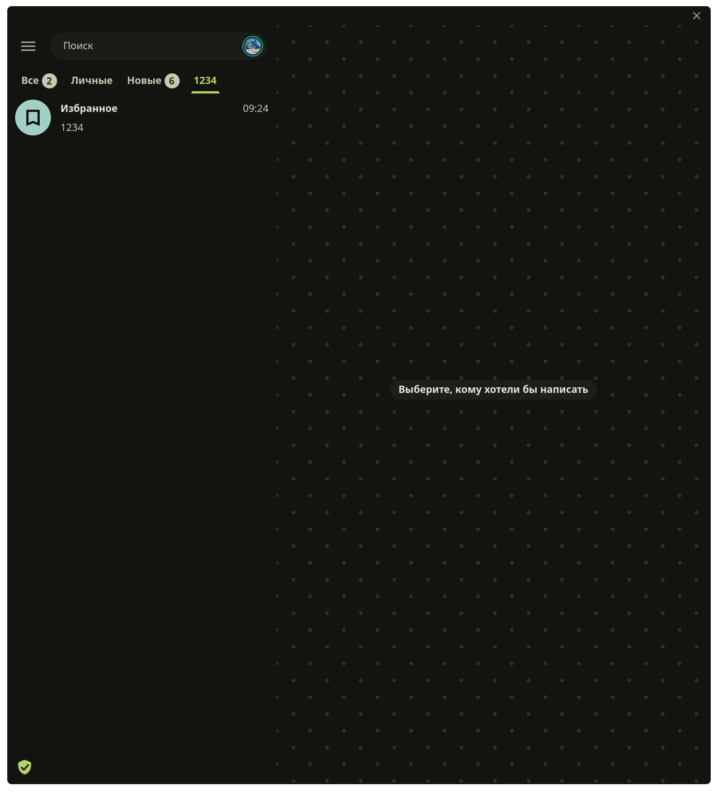
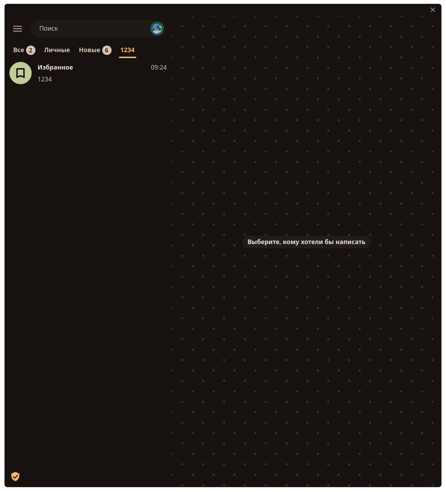

# Telegram Theme Noctalia

[🇷🇺 Русский](README_RU.md) | [🇺🇸 English](README.md)

<p align="center">
  
  
  
</p>

A script for automatically generating and updating a Telegram Desktop theme based on Noctalia colors.

## Installation

The easiest way to install the script and its dependencies (Python 3, Pillow) is to run this single command in your terminal:

```bash
curl -sSL https://raw.githubusercontent.com/Alexandr-Sol/telegram-theme-noctalia/master/install.sh | bash
```

This command will:
1. Install necessary system packages (supports Arch, Debian/Ubuntu, Fedora).
2. Download the script to `~/.local/bin/`.
3. Make it executable.
4. Run the initial setup.

## Noctalia Hook Setup

To automatically update the Telegram theme when Noctalia colors change, you need to add a hook:

1. Open Noctalia settings.
2. Go to **Hooks** -> **Color Generation**.
3. Add the following command:
   ```bash
   ~/.local/bin/telegram-theme-noctalia pack
   ```

## Applying the Theme in Telegram

When the `pack` command runs, the script generates a theme archive and saves it at:
```
~/.cache/telegram-theme-noctalia/noctalia.tdesktop-theme
```

To apply the theme:
1. Open your file manager and find the `noctalia.tdesktop-theme` file in the hidden `~/.cache/telegram-theme-noctalia/` folder.
2. Drag and drop this file into Telegram (e.g., into "Saved Messages").
3. Click on the sent file directly in the Telegram chat.
4. A theme preview window will appear — click **"Apply"**.

Now, whenever the colors change in Noctalia, the theme file will automatically update, and Telegram will instantly apply the new colors.

## Usage

Available script commands:
- `~/.local/bin/telegram-theme-noctalia pack` — generate the `noctalia.tdesktop-theme` ZIP archive (usually triggered by a hook).
- `~/.local/bin/telegram-theme-noctalia paths` — show current paths to the config, colors, and output file.

## Uninstallation

To completely remove the script, configuration, and generated files, run these two commands:

```bash
~/.local/bin/telegram-theme-noctalia uninstall
rm ~/.local/bin/telegram-theme-noctalia
```
